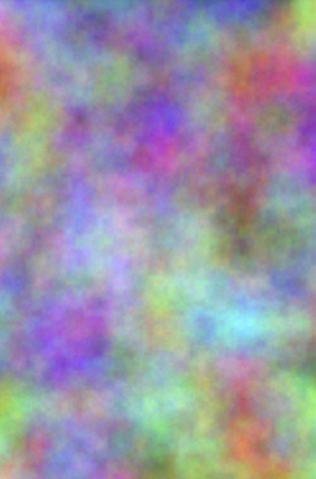
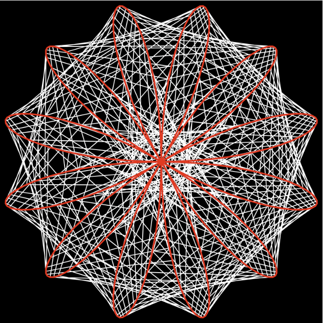

# **zvil0925_9103_tut9 WEEK 8 QUIZ**

# Part 1: Imaging Technique Inspiration

The imaging technique I am drawing inspiration from involves generative patterns. Consisting of 2 main elements, the background will provide a fog like ambiance--abstract, gradient, and figureless. 

[Rainbow Fog by Arhamdhanki](https://editor.p5js.org/arhamdhanki/sketches/iADnThk9-)

As a stark contrast to the background, the foreground will be a geometric, symmetric element similar to a Maurer Rose with inner connecting lines. 

[Maurer Rose - Perlin Noise by Dwino](https://editor.p5js.org/dwino/full/O2xBcdksk)

Both elements will be made to response according to audio data from a music file. Different parameters could be linked to loudness, frequency content, rhythm, etc. 

# Part 2: Coding Technique Exploration

### For Generative Patterns:
1. Rainbow Fog
    - Perlin Noise Fields
    - Pixel Array Manipulation
    - Channel Offsets
    
    Creates smooth evolving colour atmospheres that feel organic and immersive
2. Maurer Rose
    - Parametric Math
    - Polar Coordinates
    - Iterative line drawing
    
    Adds geometric structure

### For Detecting Audio Input for Visual Elements to Respond to:
 - Real-time FFT Analysis
 - Amplitude Detection
 - Bass Response
 > *Real‑time FFT analysis, amplitude detection, and bass‑responsive triggers allow these visuals to react dynamically to music. Low frequencies can distort the fog, mid‑range energy can modulate the rose’s radius, and amplitude peaks can drive colour or motion. Together, these techniques produce a cohesive, music‑synchronised generative artwork that blends fluid ambience with precise mathematical form.*
 
 
 
 [In-Action](https://music-visualizer-dpoppe7.netlify.app/)

 [Music Visualiser Code](https://github.com/dpoppe7/Music-Visualizer)
